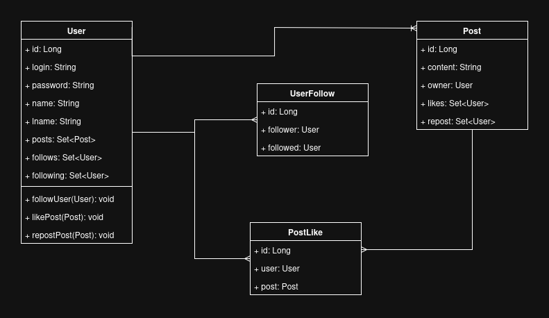

# Project X

This project was created to implement and test some knowledge about caching, this isn't the first time that i start 
this project, but this time i challenged myself to commit each step, so every will be new every week. I know this 
text there are some orthography errors because english isn't my mother language, so that will be another challenger too.

## Time to explain what is the project...
The X or Twitter is a social media that used by million of people round the world, and there are some functions that 
interesting to implement caching, and show how "magic" is the cache power.

### Those are the steps that i'll follow to make this project:
Some topics will be deleted or change during the process.

1- User authentication and management:

* Register a new user: POST /auth/register
* User login: POST /auth/login
* Get single user by Id: GET /users/{userId}
* Update user details: PUT /users/{userId}
* Delete a user: DELETE /users/{userId}

2- Tweets creation, retrieval, and deletion:

* Create a tweet: POST /tweets
* Get a single tweet: GET /tweets/{tweetId}
* Delete a tweet: DELETE /tweets/{tweetId}

3- Following and unfollowing users:

* Get followers: GET /users/{userId}/followers
* Get followings : GET /users/{userId}/following
* Follow userId: POST /users/{userId}/following
* Unfollow user: DELETE /users/{sourceUserId}/following/{targetUserId}

4- Liking and unliking tweets:

* Like a tweet: POST /users/{userId}/likes
* Get user' liked tweets: GET /users/{userId}/likes
* Get tweet's liking users: GET /tweets/{tweetId}/likes
* Unlike a tweet: DELETE /users/{userId}/likes/{tweetId}

5- Retweeting and undoing retweets:

* Retweet a tweet: POST /users/{userId}/retweets
* Get tweet's retweets: GET /tweets/{tweetId}/retweeters
* Undo a retweet: DELETE /users/{userId}/retweets/{tweetId}

6- View Home Timeline and User Timeline.

* Get a single user's Home timeline: Get /users/{userId}/timelines/home
* Get a single user's Tweet timeline: Get /users/{userId}/timelines/tweet

### UML Project:

## Project details:

24/02/2025 -> Starting using H2 database, because it's easy to configuration and really powerfull for testing. Each commit will have a message to explain changes between commits.

27/02/2025 -> New entity called PostLike created for store data about who gave a like on each post, and wasn't necessary more fields like date or hour, because for now, those informations aren't necessary. Some changes was made on User and Post enity, removing the ID on constructor, the Spring will take this work.

28/02/2025 -> Created a PostRT entity using the same structure from PostLike, UserFollow was create too. Diagram image was change to insert new structure about the project. The first part for now is complet, the next step will be services and controllers.

06/03/2025 -> First service created, for now just for list all Users; Record class used to DTO. In this part i've got some problems to integrate everything, in first time i tried to use a Set Post entity in Record class, but after some reasearch i prefer just create a Set Long and ask for ids, this will be better in performance.

08/03/2025 -> First component created, Post and User convert DTO inside a class to organize the application. This part was really complicated, because i didn't know how insert PostRT and Likes to convert, after some tries i got it. Now it's possible to list all Users and Posts. The next step is adding some filters, like search by id or name.